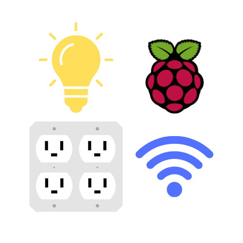
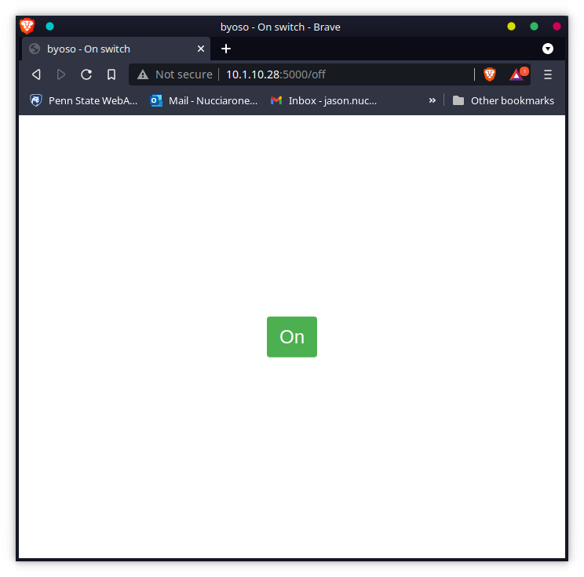
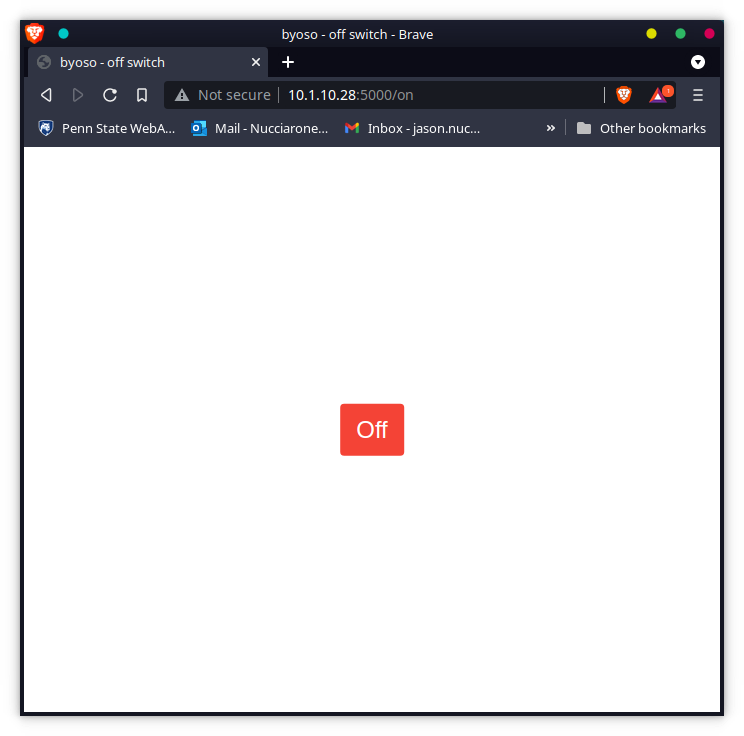

    

<h3 align="center"><b>BYOSO</b></h3>

    (B) Build (Y) Your (O) Own (S) Smart (O) Outlet using a Raspberry Pi Zero W, an outlet box, the Python Flask framework, and a simple internet connection!
     
    <i>Pronounced "by"-"oh"-"so"</i>

 

## Introduction

Do you enjoy the convenience of having smart-IoT devices automate your day-to-day tasks like turning on the lights, adjusting the thermostat, or evening brewing coffee for you in morning, but you despise the fact that said devices always need to be connected to a cloud server outside of your home to work? 

While cloud servers makes it easier for embedded devices to perform large calculations or pull data vital to its operation, cloud servers introduce a multitude of security issues. What if someone hacks the cloud server and steals your personal data? Who is accessing the data collected by your device? What are they doing with said data? I'm sure that you could find vague answers to your questions, but you would probably have to spend at least two days hunting through the license agreement you have to sign before you can start using your smart device.

Don't like having to need a law degree to figure out where your personal data is going? Well, you are in luck. In this tutorial, I am going to teach you how to build your own smart outlet that does not require some half-a-million dollar server in the middle of the Arizona desert to work. This smart outlet, as I conveniently named BYOSO, does not require a cloud server to work! All it needs is some programming know how, elbow greese, and a working internet connection. Let's get into it then! 

## Table of Contents

* [How to make your own BYOSO](#how-to-make-your-own-byoso)
* [License](#license)
* [Troubleshooting](#troubleshooting)

## How to make your own BYOSO

### Step 1: Get the parts

In order to successfully build a functioning BYOSO that does not electricute you, you will need to have the following parts on hand:

* 2-gang outlet box cover.
* 1-gang 1-switch outlet box cover.
* 2 2-gang 2-inch deep outlet box with 3/4-inch and 1/2-inch knockouts.
* Three-pronged power cable (I recommend getting one that is at least 8 feet).
* 3 outlets.
* 1 switch.
* 3 1/2-inch cable connectors.
* 16-gauge black wire for the hot wire.
* 16-gauge white wire for the neutral wire.
* 16-gauge green wire for the ground wire.
* 1 Raspberry Pi Zero W.
* 1 5-volt micro-USB power supply.
* 1 5-volt trigger Solid-State Relay board.
* 3 wires to connect the Raspberry Pi Zero W to the Solid-State Relay board.

Luckily, you can purchase most of the required hardware and wiring at your local Lowe's or Home Depot. You can purchase the Raspberry Pi Zero W and Solid-State Relay board online from a variety of vendors.

    

Once you have all the parts that you need, it is time to start putting your BYOSO together!

### Step 2: Remove knockouts and connect Outlet Boxes

In order to successfully wire BYOSO, you need to combine the outlet boxes to each other using some spare screws and nuts.

    

Before screwing the two boxes together, you will want to remove all the knockouts on the shared side of the outlet boxes. This is where the wires will pass through between the outlets and switch.

Once you have removed all the knockouts on the shared side, you will want to remove two more knockouts from one box and then remove one more knockout from the other box. The box with the two extra knockouts will contain the main power cord. The other two knockouts will be used to connect the hot wire to the Solid-State Relay.

This is what your outlet boxes should look like once you have connected them to each other:

    

### Step 3: Add Cable Connectors to connected Outlet Boxes

Nothing is worse than unsecured wires! To secure the main power cord and the hot wires that will connect to our Solid-State Relay board, we need to add some cable connectors to our connected box.

    

Attach the cable connectors to the box to the three exposed knockouts. The cable connectors I used come with a bolt to secure them in the knockouts, however, you can also use snap-in cable connectors. This is what your box with the cable connectors added:

    

### Step 4: Prepare Power Cord

Now it is time to add the power cord to your box. **Do not plug in the power cord while you are doing anything with the wires!** Electricution is one of the many things that you will be happy to leave off your bucket list.

That being said, you will want to have three wires exposed on your power cord. One for the hot wire, one for the neutral wire, and another for the ground wire. In my case, I am using a spare European-style power cord that I had lying around. The typical color coding for a three-pronged power wire is the following:

* Black (or Red) -> Hot
* White (or Black) -> Neutral
* Green -> Ground

For the European-style, the color coding is the following:

* Brown -> Hot
* Blue -> Neutral
* Green -> Ground

    

With the three wires exposed, you will want to feed the power cord through the back cable connector. You will want to feed a generous amount so that you will have some wiggle room available when you are connecting the outlets and switch. This is about how much of the power cord you will want to feed through the cable connector:

    

### Step 5: Prepare Outlets and Switch

Before wiring together the outlets and switch, break off the extra tabs using a pair of pliers.

    

This is what the outlets and switch should look like with the tabs broken off.

    

With the tabs removed, connect some pieces of your green wire to the ground terminal (the green screw) of each outlet and switch. We will use the green wires to connect to the ground wire of your power cord.

    

### Step 6: Connect Ground Wire

To connect together the green wires from the outlets and switch to the ground wire, you will need a medium sized electrical cap.

    

Attach the four green wires and ground wire to the electrical cap by screwing on the electrical cap. Once the electrical cap is screwed on, secure it to the wires using some electrical tape.

    

### Step 7: Connect Neutral Wire

Now we will want to attach the neutral wire to the outlets. First, we will want to attach the neutral wire to the outlet that will be in the same outlet box as the switch. With the neutral wire attached to the neutral terminal (silver screw) of the outlet, attach a piece of white wire to the outlet.

    

With that white wire, connect it to the neutral terminal of the second outlet. Attach other piece of white wire to the second outlet and then connect it to the neutral terminal of the third outlet.

    

### Step 8: Connect Hot Wire

    

    

    

### Step 9: Add Outlet Box Covers

    

    

### Step 10: Test Solid-State Relay Circuit

    

    

    

    

### Step 11: Connect Solid-State Relay and Raspberry Pi Zero W to Outlet Box

    

    

    

### Step 12: Setup Flask Web Server on Raspberry Pi Zero W

    

    

### The finished product!

    

## License

This repository is licensed under the GNU General Public License v3.0. For more information on what this license entails, please feel free to visit https://www.gnu.org/licenses/gpl-3.0.en.html.

## Troubleshooting

If you encounter any issues with building your own smart outlet, or if you have any general questions regarding byoso, then please feel free to open an issue on this repository or contact me at jason@nucci.tech!
